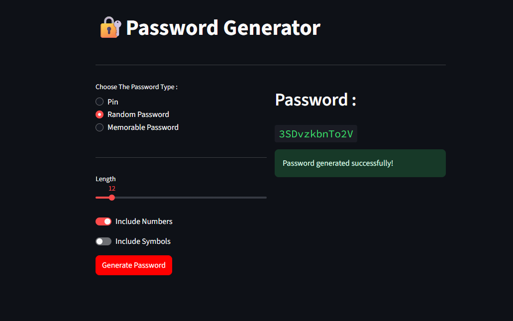

# 🔐 Password Generator

A simple Python application to generate secure and customizable passwords. Supports the following types:

- **PIN**: Numeric codes of any length.
- **Random Password**: Mix of letters, digits, and symbols.
- **Memorable Password**: Easy-to-remember passphrases made from English words.

## 🖥️ GUI version




## 🚀 Features

- Object-Oriented design with an abstract base class `PasswordGenerator`.
- Multiple password generation strategies:
  - `PinGenerator`
  - `RandomPasswordGenerator`
  - `MemorablePasswordGenerator`
- Interactive CLI for user input.
- GUI version using Streamlit for a user-friendly experience.
- Customizable password length and character sets.
- Handles invalid inputs gracefully.


## 🛠 Requirements

- Python 3.6+
- `nltk` library
- `streamlit` library

Install the required library with:

```bash
python install -r requirements.txt
```


## 📦 How to Use

Run the script for GUI version:
```bash
streamlit run src/app.py
```

Run the script for CLI version:
```bash
python src/password_generator.py
```

You will be prompted to choose the type of password:

### 1. PIN
Generates a numeric PIN code.


### 2. Random Password
Generates a random password using:

- Letters only

- Letters + Numbers

- Letters + Numbers + Symbols


### 3. Memorable Password
Generates a password using real English words separated by hyphens.


## 🧠 Code Structure
- **PasswordGenerator**: Abstract base class.

- **PinGenerator**: Generates numeric-only PINs.

- **RandomPasswordGenerator**: Generates customizable random passwords.

- **MemorablePasswordGenerator**: Uses real words for memorable passwords.

## ⚠️ Notes

- Memorable passwords require the **NLTK** corpus words to be downloaded.
- GUI version requyire the **Streamlit** to be downloaded.
